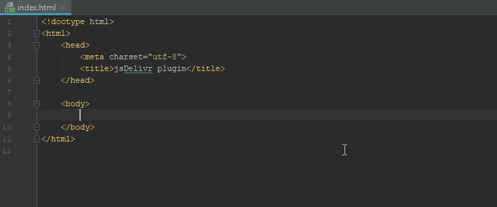

# plugin-intellij

Quickly insert any npm package from [jsDelivr CDN](https://www.jsdelivr.com).

Use a keyboard shortcut (Alt + A by default) or choose "Add jsDelivr package"
from the context menu to bring up the search window.

## Features

 - Insert just the URL, HTML code, or HTML + SRI.
 - Offers [minified versions](https://www.jsdelivr.com/features#minify) of all CSS/JS files.
